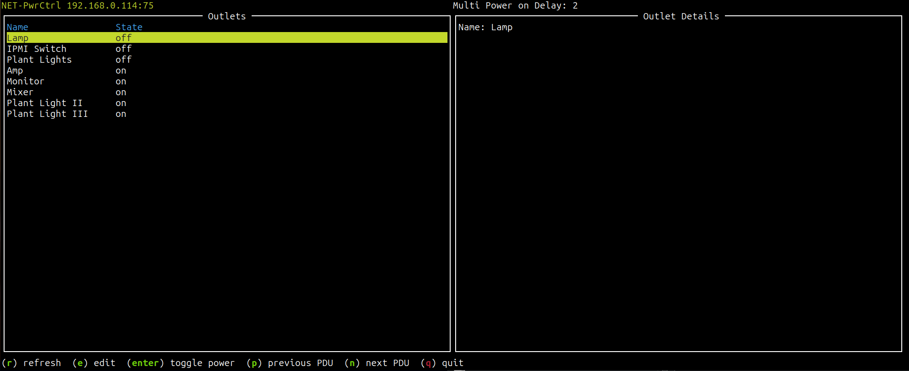
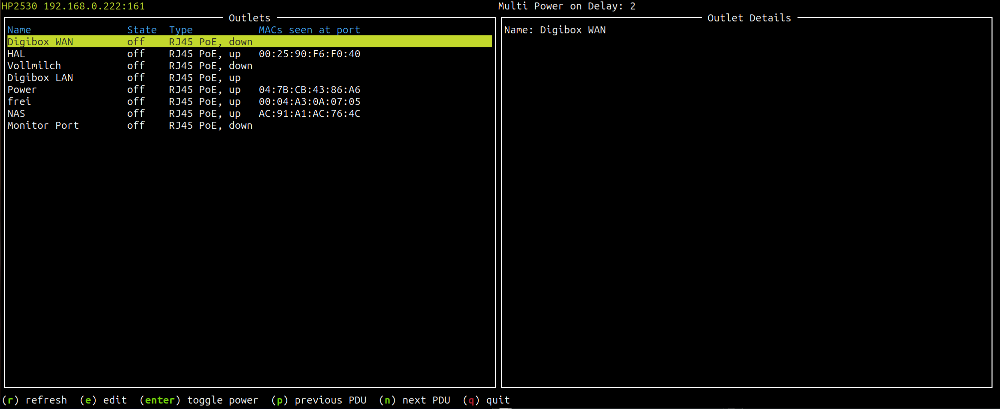
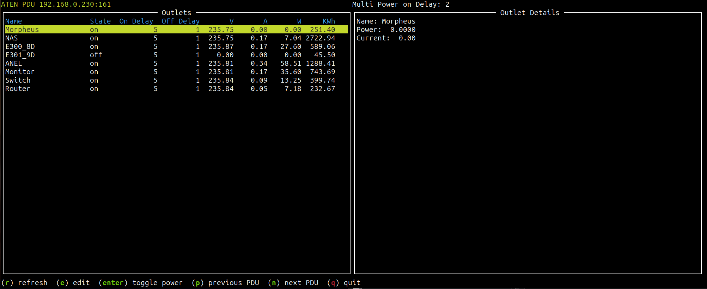
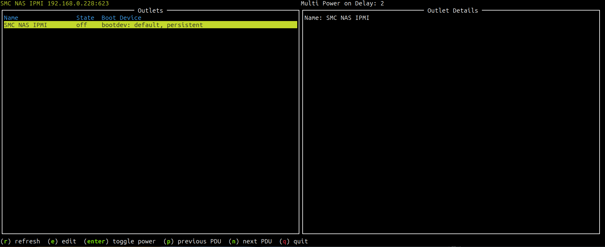

# Network power switch

I use it to toggle power of different devices

- ANEL NET-PwrCtrl - a network power strip with indiviually switchable outlets
- ATEN PDU - a fancier version of a network power strip additionally with per outlet power measurement
- Computers with IPMI or Redfish support
- PoE port power status of my HP 2530 switch, it should work with other switches IIRC

## Requirements

- Python 3
- pysnmp
- pyghmi

## Screenshots

ANEL NetPwrCtrl

PoE Switch

ATEN PDU

IPMI Host

## Usage

Create the configuration as ~/.netpwrctrl.ini
Run the program either directly:

	`python3 netpwrctrl.py`

or put it in your path an just execute

	`netpwrctrl.py`

## Configuration

The configuration file must be in .ini format. Each device is configured
in a section. The section name can be chosen freely. The name of the selected
device will be displayed in the upper left corner.

Available device types are:  

- anel_powerstrip for power strips from ANEL
- poe_pse in case of a poe switch (PSE=power sourcing equipment)
- ipmi
- redfish

Example config with all supported device types:

	
	[NET-PwrCtrl]
	device=anel_powerstrip
	host=192.168.31.121
	port=75
	user=user1
	pwd=anel
	1=Lamp
	2=IPMI Switch
	3=Plant Lights
	4=Amp
	5=Monitor
	6=Mixer
	7=Plant Light II
	8=Plant Light III
	#preset1=0,0,0,0,0,0,0,0
	#preset2=0,0,0,0,0,0,0,0
	#preset3=0,0,0,0,0,0,0,0
	
	[HP2530]
	device=poe_pse
	host=192.168.31.122
	port=161
	user=probe
	authkey=snmpauthkey
	auth_protocol=SHA
	privkey=snmpprivkey
	priv_protocol=DES
	#preset1=0,0,0,0,0,0,0,0
	#preset2=0,0,0,0,0,0,0,0
	#preset3=0,0,0,0,0,0,0,0
	
	[ATEN PDU]
	device=aten_pdu
	host=192.168.31.130
	port=161
	user=snmpusername
	authkey=snmpauthkey
	auth_protocol=MD5
	privkey=snmpprivkey
	priv_protocol=AES
	#preset1=0,0,0,0,0,0,0,0
	#preset2=0,0,0,0,0,0,0,0
	#preset3=0,0,0,0,0,0,0,0
	
	[SMC NAS IPMI]
	device=ipmi
	host=192.168.31.140
	port=623
	user=username
	pwd=password
	
	[SMC NODE 1 Redfish]
	device=redfish
	host=192.168.31.140
	port=443
	user=username
	pwd=password
